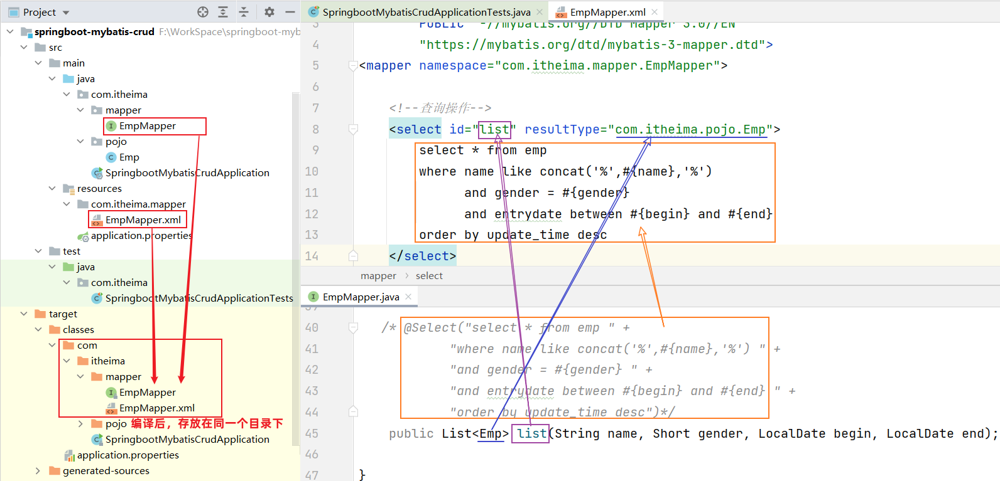

```mysql
ACID:原子性 一致性 隔离性 持久性
别忘了updatetime！
#建表语法：
create table  表名(
	字段1  字段1类型 [约束]  [comment  字段1注释 ],
	字段2  字段2类型 [约束]  [comment  字段2注释 ],
	......
	字段n  字段n类型 [约束]  [comment  字段n注释 ] 
) [ comment  表注释 ] ;
约束：not nul、unique、primary key、default、foreign key

#查询当前数据库所有表
show tables;

#添加字段
alter table 表名 add  字段名  类型(长度)  [comment 注释]  [约束];


#insert语法：

- 向指定字段添加数据
  insert into 表名 (字段名1, 字段名2) values (值1, 值2);

- 全部字段添加数据
  insert into 表名 values (值1, 值2, ...);

- 批量添加数据（指定字段）
  insert into 表名 (字段名1, 字段名2) values (值1, 值2), (值1, 值2);

- 批量添加数据（全部字段）
  insert into 表名 values (值1, 值2, ...), (值1, 值2, ...);

#update语法：
update 表名 set 字段名1 = 值1 , 字段名2 = 值2 , .... [where 条件] ;别忘了逗号


#delete语法：
delete from 表名  [where  条件] ;条件想表示集合要用in，如where id in(1,2,3)

#基本查询：
SELECT
	字段列表
FROM
	表名列表
WHERE
	条件列表
GROUP  BY
	分组字段列表
HAVING
	分组后条件列表
ORDER BY
	排序字段列表
LIMIT
	分页参数
	

- 查询多个字段
  select 字段1, 字段2, 字段3 from  表名;

- 查询所有字段（通配符）
  select *  from  表名;

- 设置别名
  select 字段1 [ as 别名1 ] , 字段2 [ as 别名2 ]  from  表名;

- 去除重复记录
  select distinct 字段列表 from  表名;

#条件查询：别忘了有like% null等等
select  字段列表  from   表名   where   条件列表 ;

#聚合函数：
| count | 统计数量 |
| max   | 最大值   |
| min   | 最小值   |
| avg   | 平均值   |
| sum   | 总和     |
select  聚合函数(字段列表)  from  表名 ;

#分组查询：
select  字段列表,聚合函数()  from  表名  [where 条件]  group by 分组字段名  [having 分组后过滤条件];

#排序查询：倒序是desc
select  字段列表  
from   表名   
[where  条件列表] 
[group by  分组字段 ] 
order  by  字段1  排序方式1 , 字段2  排序方式2 … ;

#分页查询：
select  字段列表  from   表名  limit  起始索引, 查询记录数 ;

占位符用#{...};即使用这个占位符去获取下面对应方法的形参，如果形参是个类，要保持类中的属性要与#{...}中的...是同名！！！如
@Insert("insert into emp(username, name, gender, image, job, entrydate, dept_id, create_time, update_time) values (#{username}, #{name}, #{gender}, #{image}, #{job}, #{entrydate}, #{deptId}, #{createTime}, #{updateTime})")前面是字段名，后面是属性名，属性名要是下面的Emp类中的属性名，带下划线的能对应得上是因为在ap中开了驼峰映射（操作mybatis的一些属性就是在ap中操作）
    public void insert(Emp emp); 
其中一些格式以及主键返回等等可以见day09。

动态SQL见下方
```

在Mybatis中使用XML映射文件方式开发，需要符合一定的规范：
1. XML映射文件的名称与Mapper接口名称一致（像下面的EmpMapper接口与EmpMapper.xml就相同名字），并且将XML映射文件和Mapper接口放置在相同包下（同包同名） 
2. XML映射文件的namespace属性为Mapper接口全限定名一致（即从java目录下的第一个目录开始递归去写）
3. XML映射文件中sql语句的id与Mapper接口中的**方法名**一致，并保持返回类型一致。

## XML配置文件实现 <！-- {docsify-ignore} -->

第1步：创建XML映射文件，一定要多次检查名字是否写对！！！多一个字母都不可以！


第2步：编写XML映射文件

> xml映射文件中的dtd约束，直接从mybatis官网复制即可，搜mybatis中文网

~~~xml
<?xml version="1.0" encoding="UTF-8" ?>
<!DOCTYPE mapper
  PUBLIC "-//mybatis.org//DTD Mapper 3.0//EN"
  "https://mybatis.org/dtd/mybatis-3-mapper.dtd">
<mapper namespace="">
 
</mapper>
~~~


配置：XML映射文件的namespace属性为Mapper接口全限定名


~~~xml
<?xml version="1.0" encoding="UTF-8" ?>
<!DOCTYPE mapper
        PUBLIC "-//mybatis.org//DTD Mapper 3.0//EN"
        "https://mybatis.org/dtd/mybatis-3-mapper.dtd">
<mapper namespace="com.itheima.mapper.EmpMapper">

</mapper>
~~~


**配置：XML映射文件中sql语句的id与Mapper接口中的方法名一致，并保持返回类型一致**

*注：resultType是单条记录封装的类型，像下面这个例子，方法返回的是**一个集合**，不是单条记录，单条记录应该是集合的类型即emp，所以要在pojo包的实体类下对类名copy reference粘贴到合适的位置*



~~~xml
<?xml version="1.0" encoding="UTF-8" ?>
<!DOCTYPE mapper
        PUBLIC "-//mybatis.org//DTD Mapper 3.0//EN"
        "https://mybatis.org/dtd/mybatis-3-mapper.dtd">
<mapper namespace="com.itheima.mapper.EmpMapper">

    <!--查询操作-->
    <select id="list" resultType="com.itheima.pojo.Emp">
        select * from emp
        where name like concat('%',#{name},'%')
              and gender = #{gender}
              and entrydate between #{begin} and #{end}
        order by update_time desc
    </select>
</mapper>
~~~

> 运行测试类，执行结果：
>
> 

```xml
<if test="条件表达式">
   要拼接的sql语句
</if>
#
<select id="list" resultType="com.itheima.pojo.Emp">
        select * from emp
        where
    
             <if test="name != null">
                 name like concat('%',#{name},'%')
             </if>
             <if test="gender != null">
                 and gender = #{gender}     and别忘记写，还是先写静态sql然后再改造成动态
             </if>
             <if test="begin != null and end != null">
                 and entrydate between #{begin} and #{end}
             </if>
    
        order by update_time desc
</select>
                                  
如果想其中一个生效就能查询，即类似于or语句，那么把where改成<where></where>
在用update语句的时候，也要把set改成<set></set>

<foreach collection="集合名称" item="集合遍历出来的元素/项" separator="每一次遍历使用的分隔符" 
         open="遍历开始前拼接的片段" close="遍历结束后拼接的片段">
</foreach>集合名称与mapper接口中的方法中的保持一致即可
如：delete from emp where id in (1,2,3);//SQL语句
<delete id="deleteByIds">
        delete from emp where id in
        <foreach collection="ids" item="id" separator="," open="(" close=")">
            #{id}看day09的对应关系
        </foreach>
    </delete>


<sql id="commonSelect">id名可以改
 	select id, username, password, name, gender, image, job, entrydate, dept_id, create_time, update_time from emp(这些都是重复代码)
</sql>
然后在重复使用的地方再用上<include refid="commonSelect"/>即可，如：
<select id="list" resultType="com.itheima.pojo.Emp">
    <include refid="commonSelect"/>
    <where>
        <if test="name != null">
            name like concat('%',#{name},'%')
        </if>
    </where>
    order by update_time desc
</select>
```

- `<if>`

  - 用于判断条件是否成立，如果条件为true，则拼接SQL

  - 形式：

    ~~~xml
    <if test="name != null"> … </if>
    ~~~

- `<where>`

  - where元素只会在子元素有内容的情况下才插入where子句，而且会自动去除子句的开头的AND或OR

- `<set>`

  - 动态地在行首插入 SET 关键字，并会删掉额外的逗号。（用在update语句中） 
