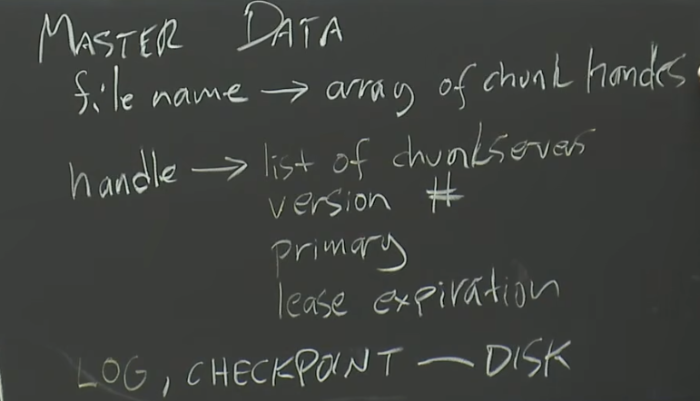

# LEC  1

几个只能通过网络发送/接收数据包进行交互的系统，即构成分布式系统。(非正式)

 使用分布式系统的场景/原因：

- 机器资源共享 (sharing)
- 通过并行提高性能 (increase capacity though parallelism)
- **提高服务容错性 (tolerate faults)**
- 利用物理隔离的手段提高整体服务安全性 (achieve security via isolation)

文件被划分为若干个64MB大小的chunk（块）。每个chunk被一个不可变的全局唯一的64位chunk handle（块标识符）唯一标识，chunk handle在chunk被创建时由主节点分配。

比如说文件1对应着块1，块3，块5这几个块标识符（是64位的，只不过这里简单写了一下）（每个块都有多个副本）

比如说块1，块3，块5对应着某几个块服务器，以及版本号，以及块1/3/5多个副本中哪个副本对应着primary，还有租约过期信息

log与检查点要写入磁盘中

